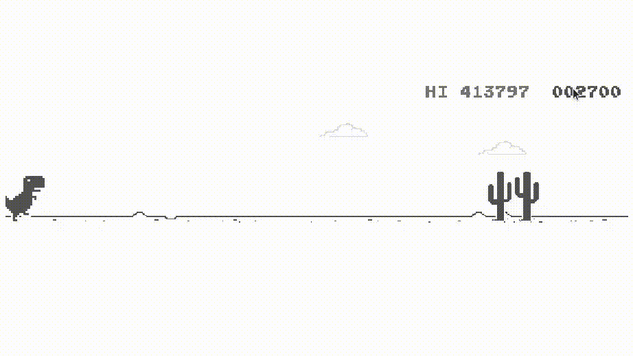
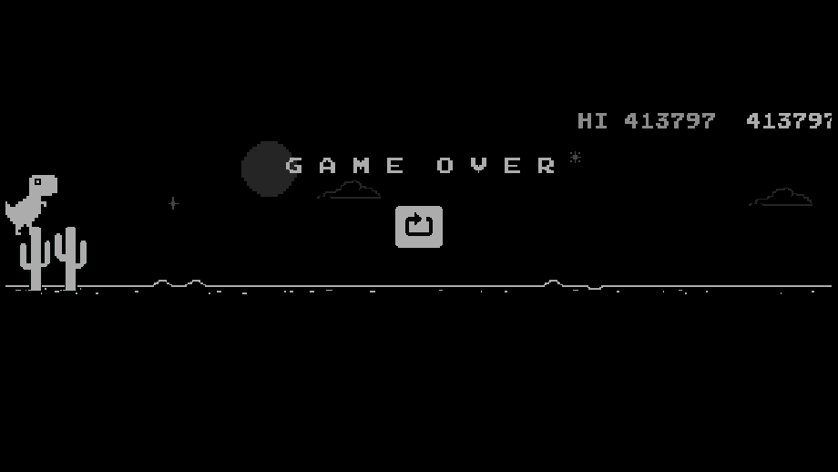
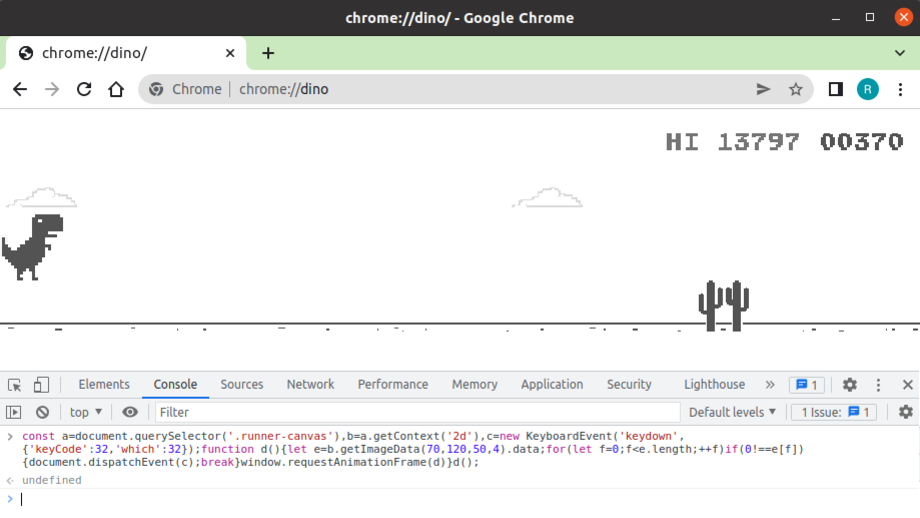

# AutoTRex
Let the Computer Play TRex

**Using vanilla JavaScript, automating T-Rex Dinosaur Game - Chrome Dino Runner**

    
     
    Computer playing TRex

## Highest Score
I kept my computer running for 6 hrs and then closed the game because it appeared to be a never-ending game. The score was 413791, as shown in the screenshot below:

## Run
1. Open Chrome browser and navigate to chrome://dino
2. Open the developer console by right-clicking on the page and selecting "Inspect"
3. Copy the content of the [game.min.js](https://github.com/ravijo/AutoTRex/blob/main/game.min.js) and paste it into the prompt
4. Press the Enter key to start the execution of the code, and then press the Space bar key on the page to activate the game

## Issues (or Error Reporting)
Please check [here](https://github.com/ravijo/AutoTRex/issues) and create issues accordingly.
 
